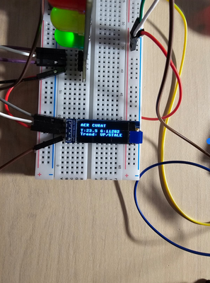
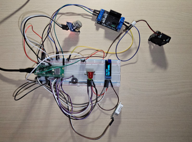
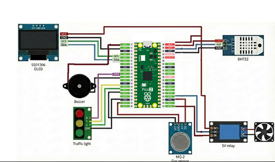
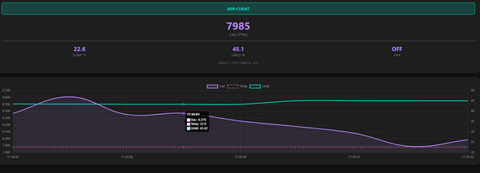

# **Smart-Safety-Monitor-IoT**


### Proiect realizat de studenții:

* **Afloroaei Daniel**
* **Mârț Eduard**
* **Lostun Șerban-Ilie**


   

### Adrese e-mail: 

* [daniel.afloroaei@student.tuiasi.ro](mailto:daniel.afloroaei@student.tuiasi.ro)                            
* [eduard.mart@student.tuiasi.ro](mailto:eduard.mart@student.tuiasi.ro)                 
* [serban-ilie.lostun@student.tuiasi.ro](mailto:serban-ilie.lostun@student.tuiasi.ro)


### 1. Motivația alegerii temei:

Am ales această temă deoarece siguranța, fie că vorbim de case sau de spații industriale, este esențială. Prevenirea accidentelor grave cauzate de scurgerile de gaz sau incendii este o problemă critică.

Proiectul nostru, ***Smart Safety Monitor IoT***, abordează această problemă și ne-a permis să demonstrăm două aspecte importante:

1. **Funcționalitatea avansată pe un dispozitiv mic:** Am arătat cum un dispozitiv de mici dimensiuni poate funcționa ca un sistem inteligent de siguranță:
    * Acesta preia rolul de unitate de control pentru a gestiona senzorii și a lua decizii rapide (similar cu ce face un PLC în industrie).
    * În același timp, funcționează ca un server web, permițând monitorizarea de la distanță direct de pe telefon sau calculator.
2. **Explorarea MicroPython:** Din punct de vedere tehnic, am folosit acest proiect pentru a explora cum putem face ca MicroPython să execute mai multe sarcini simultan (multitasking) pentru a asigura o reacție rapidă și eficientă a sistemului de monitorizare.


### 2. Rezumat

Proiectul propune un **sistem inteligent de monitorizare a siguranței (Smart Safety Monitor IoT)**, conceput pentru detecția rapidă și prevenția riscurilor asociate scurgerilor de gaze, prezenței de fum și incipientului incendiu.

**Arhitectura sistemului cuprinde următoarele componente și funcționalități esențiale:**

* **Unitatea Centrală de Procesare:** Utilizarea unui microcontroler **Raspberry Pi Pico WH** ca unitate centrală de achiziție și procesare a datelor.  
* **Achiziția de Date:** Sistemul integrează senzori dedicați: un senzor de gaz/fum (**MQ-2**) și un senzor de monitorizare a condițiilor de mediu (temperatură și umiditate – **DHT22**), asigurând o monitorizare continuă a parametrilor critici. 
* **Răspuns Automat (Actuare):** La detecția unei stări de pericol, unitatea centrală inițiază un răspuns imediat prin activarea dispozitivelor de siguranță (actuatori), incluzând un avertizor sonor (buzzer), un ventilator pentru dispersia gazelor și indicatori vizuali (LED-uri de stare). 
* **Monitorizare la Distanță și Interfață Web:** Prin intermediul capacității Wi-Fi a microcontrolerului, acesta găzduiește o interfață web minimalistă. Aceasta permite vizualizarea datelor în timp real și monitorizarea stării sistemului de pe orice dispozitiv conectat la rețea.


### 3. Importanța în Domeniul Sistemelor Integrate (SI)

Arhitectura proiectului validează implementarea cu succes a următoarelor principii esențiale din ingineria sistemelor integrate:

* **Procesare Asincronă (Multitasking Logic):** Prin adoptarea framework-ului uasyncio, am realizat o execuție concurentă, non-blocantă, a serverului web și a algoritmului de control al senzorilor. Această abordare este esențială pentru a asigura o funcționare neîntreruptă a interfeței de monitorizare, menținând în același timp o latență minimă pentru logica de detecție critică. 
* **Robustetea Achiziției de Date:** Am implementat un filtru **EMA (Exponential Moving Average)** la nivelul citirilor de la senzori, alături de mecanisme de histerezis și contori de confirmare. Această metodologie avansată de prelucrare a semnalului este crucială pentru a asigura integritatea datelor și pentru a preveni activările intempestive sau alertele false (fals-pozitive). 
* **Interfațare și Actuare Profesională:** Sistemul demonstrează utilizarea eficientă a protocolului de comunicație I2C pentru controlul display-ului OLED și implementează controlul actuatorilor de putere (precum ventilatorul) prin intermediul modulelor de releu. Aceste alegeri subliniază o integrare hardware-software adecvată standardelor de aplicații embedded.


### 4. Analiză, Design și Implementare


#### 1. Analiza Sistemului:

Proiectul nostru a fost dezvoltat pe baza unei **Mașini de Stări Finite (FSM - Finite State Machine)**. Această abordare riguroasă ne-a permis să gestionăm logic și eficient corelarea datelor de la senzorii multipli pentru a asigura siguranța.

Spre deosebire de sistemele simple cu praguri fixe, am implementat un algoritm de **calibrare dinamică** la pornire (timp de 20 de secunde). Această calibrare automată stabilește nivelul de referință al gazului ambiental, optimizând sensibilitatea sistemului și reducând semnificativ alarmele false cauzate de variațiile naturale ale mediului.

**Taxonomia Stărilor Operaționale**

Sistemul poate opera în șase stări distincte, definite prin logica noastră de control:

1. **AER CURAT (Normal):** Parametrii de gaz sunt sub pragul de alertă, iar temperatura este stabilă. 
2. **ATENȚIE - FUM:** A fost detectată o concentrație de gaz care a depășit pragul intermediar de alertă. 
3. **SUPRAÎNCĂLZIRE:** A fost identificată o creștere anormală a temperaturii în lipsa detectării de fum. 
4. **INCENDIU:** Stare critică definită de convergența simultană a temperaturii ridicate și a prezenței de fum. 
5. **PERICOL EXPLOZIE:** A fost depășit un prag critic de acumulare a gazelor inflamabile. 
6. **RĂCIRE:** O stare de tranziție post-eveniment, menținută până la stabilizarea completă a tuturor parametrilor fizici.


#### 2. Design-ul Sistemului:

**Unitatea Centrală de Procesare (UCP)**

* Microcontroler **Raspberry Pi Pico W**

**Subsistemul de Achiziție (Senzori)**

* Senzor de gaz/fum **MQ-2**
* Senzor de temperatură/umiditate **DHT22**

**Subsistemul de Ieșire (Actuatori și Vizualizare)**

* Display **OLED 1.3"**
* Modul **Releu** (pentru Ventilator)
* **Buzzer** Activ
* Indicatori **LED Tricolori**







#### 3. Implementare:

Pentru a asigura fiabilitatea și precizia sistemului, am integrat următoarele tehnici avansate de procesare a semnalului și optimizare:

* **Filtrarea Datelor (EMA - Exponential Moving Average):**
    * Am folosit un filtru EMA pentru a atenua zgomotul de fond din citirile de temperatură, asigurând o măsurătoare mai stabilă. 
* **Histerezis Software (Cooling Counter):**
    * Am introdus un mecanism de confirmare (un contor de răcire) pentru a preveni oscilația rapidă de tip pornit/oprit la nivelul releului.
    * Schimbarea stării din alarmă înapoi la normal se face doar după ce sistemul validează **trei citiri consecutive descendente** (sub prag), confirmând stabilizarea reală. 
* **Sistem de Alarmare Multinivel:**
    * Semnalele acustice și vizuale sunt diferențiate în funcție de severitatea stării (ex: pulsuri rapide pentru stările critice și avertizări intermitente pentru stările de atenție).
* **Auto-Adaptarea Referințelor (Slow Learning):**
    * În condiții de stabilitate termică, sistemul ajustează lent mediile de referință pentru temperatură și umiditate, adaptându-se natural la mediul ambiant.


### 5. Ce se învață dacă se replică proiectul:

Replicarea acestui sistem de monitorizare a siguranței mediului oferă un set complex de competențe tehnice, acoperind atât latura de hardware, cât și cea de software modern pentru sisteme înglobate:

* **Fundamentele Programării Asincrone (uasyncio):** Se dobândește o înțelegere practică a multitasking-ului cooperativ. Replicarea proiectului învață utilizatorul cum să gestioneze sarcini concurente (citirea senzorilor, actualizarea afișajului și menținerea unui server web) pe un procesor cu un singur nucleu eficient, fără a bloca execuția codului critic pentru siguranță. 
* **Ingineria Datelor și Filtrare Digitală:** Proiectul oferă o bază solidă în procesarea semnalelor brute. Se învață implementarea algoritmilor de tip **EMA (Exponential Moving Average)** pentru eliminarea zgomotului de fond de la senzorii analogici și utilizarea **histerezisului software** pentru controlul stabil al actuatorilor (prevenirea fenomenului de *chattering* la relee). 
* **Dezvoltarea de Interfețe IoT și Gestiune Web:** Se învață modul de transformare a unui microcontroler într-un server web capabil să servească pagini HTML și să comunice prin **JSON**. Utilizatorul va înțelege cum să integreze biblioteci de vizualizare a datelor (precum **Chart.js**) pentru a crea tablouri de bord (dashboards) interactive, accesibile prin rețeaua Wi-Fi. 
* **Interfațarea Hardware și Protocoale de Comunicare:** Replicarea sistemului dezvoltă abilități practice de configurare și depanare pentru diverse interfețe: **ADC** (pentru senzorul de gaz), **Digital One-Wire** (pentru DHT22) și **I2C** (pentru controlul display-ului OLED). De asemenea, se înțelege logica de control al sarcinilor de putere prin module de izolare (relee). 
* **Managementul Resurselor în Sisteme cu Memorie Limitată:** Un aspect critic învățat este optimizarea consumului de memorie RAM. Prin utilizarea tehnicilor de monitorizare a heap-ului și apelarea strategică a **Garbage Collector-ului (`gc.collect()`)**, utilizatorul învață să dezvolte aplicații robuste care pot rula pe perioade lungi fără erori de tip *MemoryError*. 


### 6. Cod:

#### 1. Filtrarea Datelor și Logica de Histerezis
```python
# Filtru EMA (Exponential Moving Average) pentru stabilitatea citirilor
# Formula: Valoare_Noua = (Valoare_Veche * alpha) + (Citire_Senzor * (1 - alpha))
curr_t = (curr_t * 0.6) + (t_raw * 0.4)
curr_h = (curr_h * 0.6) + (h_raw * 0.4)

# Logica de Histerezis pentru confirmarea răcirii
# Previne oscilațiile rapide (chattering) ale releului
if curr_t < (prev_temp_read - 0.05):
    cooling_counter += 1  # Confirmăm tendința de scădere
else:
    cooling_counter = 0   # Resetăm la orice stagnare sau creștere

# Flag de răcire confirmată doar după atingerea pragului (ex: 3 citiri)
is_confirmed_cooling = (cooling_counter >= COOLING_THRESHOLD)
```
#### 2. Calibrarea Automată la Pornire
```python
# Procedura de calibrare gaz (20 secunde)
s = 0
for i in range(200):
    val = hardware.read_gaz()
    s += val
    hardware.draw_calibration_bar(i, 200) # Bara de loading pe OLED
    await asyncio.sleep(0.1)

base_gaz = int(s / 200)
PRAG_FUM = base_gaz + 1500
PRAG_GAZ_CRITIC = base_gaz + 6000
```
#### 3. Logica Decizională (Mașina de Stări)
```python
# Fragment din logica de decizie
if gaz >= PRAG_GAZ_CRITIC:
    status = "PERICOL EXPLOZIE"
    led_req = 'R'; fan_req = True; buzz_req = 2
elif delta_t >= 10.0:
    if not is_confirmed_cooling:
        status = "INCENDIU" if gaz >= PRAG_FUM else "SUPRAINCALZIRE HW"
        led_req = 'R'; fan_req = True; buzz_req = 2
    else:
        status = "RACIRE COMPONENTE"
        led_req = 'G_BLINK'; fan_req = True
```
#### 4. Bucla Principală Asincronă
```python
async def main_loop():
    # ... (init și calibrare)
    asyncio.create_task(server.start_server(state)) # Pornire server web în fundal

    while True:
        gaz = hardware.read_gaz()
        # Sampling DHT la interval definit în config
        if time.ticks_diff(time.ticks_ms(), last_dht_read) > config.DHT_SAMPLE_INTERVAL:
            # ... procesare senzori
        
        # Execuție comenzi hardware și update OLED
        hardware.set_fan(fan_req)
        hardware.update_oled(status, gaz, curr_t, trend_str)
        
        gc.collect() # Prevenirea fragmentării memoriei RAM
        await asyncio.sleep(0.05)
```

### 7. Bibliografie

* [https://www.raspberrypi.com/documentation/microcontrollers/pico-series.html](https://www.raspberrypi.com/documentation/microcontrollers/pico-series.html)
* [https://cdn.sparkfun.com/assets/f/7/d/9/c/DHT22.pdf](https://cdn.sparkfun.com/assets/f/7/d/9/c/DHT22.pdf)
* [https://cdn.sparkfun.com/assets/3/b/0/6/d/MQ-2.pdf](https://cdn.sparkfun.com/assets/3/b/0/6/d/MQ-2.pdf)
* [https://docs.micropython.org/en/latest/](https://docs.micropython.org/en/latest/)
